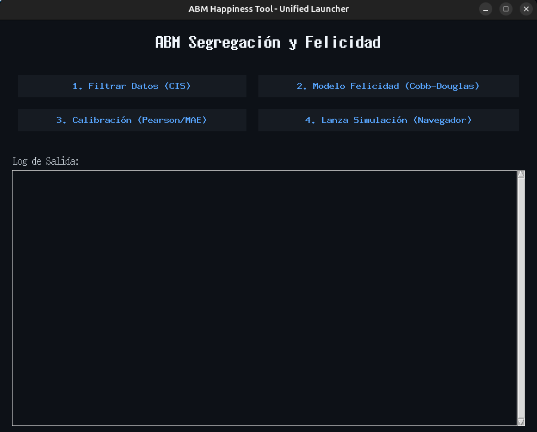

# Dinámicas de Segregación Socioeconómica y Contagio Emocional en Redes Sociales

> [!TIP]
> **Web del Proyecto (Documentación Online)**
> Puedes consultar la documentación completa, resultados interactivos y metodología en nuestra página web:
> 👉 **[https://jxliian.github.io/ABM-Income-Interpersonal-Relations-Impact-on-Happiness](https://jxliian.github.io/ABM-Income-Interpersonal-Relations-Impact-on-Happiness)**

> [!CAUTION]
> **Estructura de la Web (GitHub Pages)**
> Los siguientes archivos y carpetas son **exclusivos para la generación de la página web** y no deben modificarse a menos que se quiera alterar el sitio:
> *   `github_pages/` (Contenido de documentación)
> *   `assets/` (Estilos CSS e imágenes web)
> *   `_includes/` (Configuración avanzada de Jekyl/HTML)
> *   `_config.yml` (Configuración del tema)
> *   `index.md` (Página de inicio de la web)

Este repositorio implementa un **Modelo Basado en Agentes (ABM)** en Python para simular la dinámica de la felicidad, la segregación económica y la sociabilidad en redes sociales. El proyecto utiliza microdatos reales del **Centro de Investigaciones Sociológicas (CIS)** para calibrar los agentes, trascendiendo los modelos puramente teóricos.

El objetivo central es investigar si la segregación espacial (la formación de "cámaras de eco") actúa como un mecanismo estructural que modula el bienestar subjetivo, analizando la interacción entre el capital económico, el tiempo disponible y el contagio emocional.

---

## Descripción del Modelo

El simulador recrea un entorno social dinámico donde agentes heterogéneos (basados en perfiles reales de Facebook, Instagram y X/Twitter) interactúan bajo reglas de **racionalidad limitada**.

### Dinámicas Principales

* **Homofilia Económica:** Los agentes tienden a segregarse espacialmente buscando vecinos con un estatus socioeconómico similar para reducir la disonancia cognitiva.
* **Contagio Emocional:** El bienestar de un agente se ve afectado por el promedio de felicidad de su entorno local (vecindad de Moore).
* **Política Económica (SMI):** Se incluye un escenario experimental con un *slider* en tiempo real para modificar el Salario Mínimo Interprofesional y observar su impacto en la cohesión social y la felicidad agregada.

### Visualización

El modelo incluye un Dashboard interactivo que muestra:

* **Grid Espacial:** Visualización de agentes con escala de colores (Rojo = Infeliz  Azul = Muy Feliz).
* **Gráficos en Tiempo Real:** Evolución de la felicidad global.
* **Estadísticas:** Monitorización de la brecha salarial, población por niveles de felicidad y renta mínima detectada.

---

## Fundamentación Teórica

El comportamiento de los agentes se rige por funciones de utilidad y teoremas sociológicos formalizados para este estudio:

### 1. Función de Utilidad Cobb-Douglas Adaptada

La felicidad () no es lineal al ingreso, sino que depende de la ponderación entre **Capital Económico ()** y **Tiempo Disponible ()**, modulada por el factor cultural  (Materialismo):

* : Sociedad Hiper-Materialista.
* : Sociedad Post-Materialista (Valora el tiempo/ocio).

### 2. Teorema de Resonancia Social Inversa

Proponemos que la sociabilidad () no es una constante, sino una propiedad emergente del bienestar. Los agentes infelices pierden capacidad de interacción social:

---

## Flujo de Funcionamiento

La herramienta sigue un proceso lógico estructurado en 4 pasos (Filtrado $\to$ Modelo $\to$ Correlaciones $\to$ Visualización).

*   **Pasos 1-3:** Se ejecutan automáticamente al iniciar la aplicación (procesamiento de datos y cálculos teóricos).
*   **Paso 4 (Visualización Interactiva):** Es el entorno gráfico donde interactúas con la simulación.
    *   ⚠️ **Importante:** Si usas el **Slider**, recuerda moverlo, pulsar **Reset** y luego **Start** para que los cambios surtan efecto.

👉 **[Guía Detallada: Cómo Funciona](./github_pages/como_funciona.md)**

---

## Instalación Rápida (Windows)

Si usas **Windows** y quieres probar la aplicación rápidamente sin instalar nada (ni Python ni librerías), sigue estos pasos:

1.  **Descarga el repositorio base:** Pulsa en el botón verde `<> Code` y elige `Download ZIP`. Descomprime el archivo.
2.  **Descarga el ejecutable:** Ve a la pestaña **[Actions](https://github.com/jxliian/ABM-Income-Interpersonal-Relations-Impact-on-Happiness/actions)**, entra en el último workflow ("Build Windows Executable") y descarga el artefacto `ABM_Happiness_Tool_Windows`.
3.  **Coloca el ejecutable:** Descomprime el artefacto y mueve el archivo `ABM_Happiness_Tool.exe` **DENTRO** de la carpeta del repositorio que descomprimiste en el paso 1 (debe estar junto a carpetas como `src`, `assets`, etc.).
4.  **Ejecuta:** Haz doble clic en `ABM_Happiness_Tool.exe`.



> **Nota:** Al ejecutarlo, puede tardar unos segundos en cargar. Si Windows Defender muestra un aviso, pulsa en "Más información" -> "Ejecutar de todas formas".

> [!IMPORTANT]
> **Ventajas y Limitaciones**
> *   ✅ **Ventaja:** No hay que instalar nada.
> *   ⚠️ **Limitación:** Esta versión ejecuta únicamente el modelo de **Facebook**. No es posible seleccionar otras redes sociales ni usar el modo experimental. Para esas funciones, se recomienda usar la instalación manual con Conda (ver abajo).

---

## Instalación y Configuración (Linux / Desarrolladores)

Para garantizar que todos los miembros del equipo utilicen la misma pila tecnológica y evitar conflictos de librerías, este proyecto utiliza un entorno virtual definido en el archivo `environment.yml`.

### 1. Instalar Anaconda

Antes de comenzar, debes tener instalada la distribución de **Anaconda** o **Miniconda**, que incluye las herramientas necesarias para la gestión de entornos.

* **Descarga:** [Web oficial de Anaconda](https://www.anaconda.com/download/success)
* **Instalación:** Ejecuta el instalador descargado. Se recomienda usar la configuración predeterminada.

### 2. Crear el Entorno Conda

Una vez instalado Anaconda, abre **Anaconda Prompt** (Windows) o tu terminal (macOS/Linux) y navega hasta la carpeta raíz del proyecto.

Ejecuta el siguiente comando para crear automáticamente el entorno con todas las dependencias necesarias (`mesa`, `pandas`, `numpy`, etc.):

```bash
conda env create -f environment.yml

```

Este comando leerá el archivo y creará un entorno aislado llamado **`abm_seminario`**.

---

---

## Ejecutables

### Windows

Si prefieres usar el ejecutable generado automáticamente (alternativa al paso anterior):
1. Ve a la pestaña **[Actions](https://github.com/jxliian/ABM-Income-Interpersonal-Relations-Impact-on-Happiness/actions)**.
2. Descarga el artefacto `ABM_Happiness_Tool_Windows` del último build.
3. Descomprímelo y ejecuta el `.exe`.

### Linux (Experimental)

Existe un ejecutable en `./dist/ABM_Happiness_Tool` generado con PyInstaller.

> **Importante:** Actualmente, el ejecutable de Linux **solo implementa correctamente hasta el Paso 2**.
> Para una experiencia completa y estable en Linux, se recomienda encarecidamente **ejecutar el código fuente** siguiendo los pasos de "Uso del Entorno" (comando `python src/graphics.py`).

---

## Uso del Entorno

Debes activar el entorno `abm_seminario` cada vez que trabajes en el proyecto para asegurar que Python cargue las versiones correctas de las librerías.

### a) Activar el Entorno

Para iniciar tu sesión de trabajo:

```bash
conda activate abm_seminario

```

Verás `(abm_seminario)` al inicio de tu línea de comandos.

### b) Ejecutar la Simulación

Para lanzar el servidor de visualización y abrir el dashboard en tu navegador:

```bash
python graphics.py

```

*(Nota: Asegúrate de que el archivo principal se llame `graphics.py` según tu estructura actual).*

Aparecerá un menú en la consola para elegir el escenario:

1. **Facebook / Instagram / X:** Escenarios estándar con datos del CIS.
2. **Modo Experimental:** Incluye el *Slider* de Salario Mínimo para alterar la economía en tiempo real.

### c) Desactivar el Entorno

Cuando termines tu sesión:

```bash
conda deactivate

```

---

## Tecnologías Utilizadas

| Componente                       | Librerías Clave                | Propósito                                                                 |
| -------------------------------- | ------------------------------- | -------------------------------------------------------------------------- |
| **Core ABM**               | `Mesa`                        | Motor de simulación, gestión de agentes, grid y scheduler.               |
| **Procesamiento de Datos** | `pandas`, `numpy`           | Limpieza, transformación y muestreo de microdatos del CIS (Estudio 3145). |
| **Visualización**         | `CanvasGrid`, `ChartModule` | Renderizado del dashboard interactivo en el navegador.                     |
| **Entorno**                | `Conda`                       | Gestión de dependencias y aislamiento del proyecto.                       |

---

## Autores y Créditos

**Autores:**

* **Julián Carrión Tovar**
* **Fernando José Gracia Choin**

**Supervisión:**

* Prof. José Luis Sáez Lozano (Universidad de Granada)

**Fuentes de Datos:**

* [Centro de Investigaciones Sociológicas (CIS)](https://www.cis.es): Estudio 3145 (Post-electoral 2016).

---

*Proyecto desarrollado para la asignatura de Economía Mundial del Doble Grado en Ingeniería Informática y ADE de la Universidad de Granada.*

# Socioeconomic Segregation and Emotional Contagion Dynamics in Social Networks

This repository implements an **Agent-Based Model (ABM)** in Python to simulate the dynamics of happiness, economic segregation, and sociability in social networks. The project uses real microdata from the **Center for Sociological Research (CIS)** to calibrate agents, transcending purely theoretical models.

The central objective is to investigate whether spatial segregation (the formation of "echo chambers") acts as a structural mechanism that modulates subjective well-being, analyzing the interaction between economic capital, available time, and emotional contagion.

---

## Model Description

The simulator recreates a dynamic social environment where heterogeneous agents (based on real profiles from Facebook, Instagram, and X/Twitter) interact under rules of  **bounded rationality** .

### Main Dynamics

* **Economic Homophily:** Agents tend to segregate spatially, seeking neighbors with a similar socioeconomic status to reduce cognitive dissonance.
* **Emotional Contagion:** An agent's well-being is affected by the average happiness of their local environment (Moore neighborhood).
* **Economic Policy (Minimum Wage):** An experimental scenario is included with a real-time *slider* to modify the Minimum Interprofessional Wage (SMI) and observe its impact on social cohesion and aggregate happiness.

### Visualization

The model includes an interactive Dashboard showing:

* **Spatial Grid:** Visualization of agents with a color scale (Red = Unhappy **$\to$** Blue = Very Happy).
* **Real-Time Charts:** Evolution of global happiness.
* **Statistics:** Monitoring of the wage gap, population by happiness levels, and detected minimum income.

---

## Theoretical Foundation

Agent behavior is governed by utility functions and sociological theorems formalized for this study:

### 1. Adapted Cobb-Douglas Utility Function

Happiness (**$H$**) is not linear to income but depends on the weighting between **Economic Capital (**$E$**)** and  **Available Time (**$R$**)** , modulated by the cultural factor **$\alpha$** (Materialism):

$$
H = E^\alpha \cdot R^{1-\alpha}, \quad \text{where } 0 \le \alpha \le 1
$$

* **$\alpha \to 1$**: Hyper-Materialistic Society.
* **$\alpha \to 0$**: Post-Materialistic Society (Values time/leisure).

### 2. Inverse Social Resonance Theorem

We propose that sociability (**$S$**) is not a constant, but an emergent property of well-being. Unhappy agents lose the capacity for social interaction:

$$
S_i = H_i \cdot (1 + H_i^{1-\alpha})
$$

---

## Installation and Environment Setup

To ensure all team members use the same technology stack and avoid library conflicts, this project uses a virtual environment defined in the `environment.yml` file.

### 1. Install Anaconda

Before starting, you must have the **Anaconda** or **Miniconda** distribution installed, which includes the necessary tools for environment management.

* **Download:** [Official Anaconda Website](https://www.anaconda.com/download/success)
* **Installation:** Run the downloaded installer. It is recommended to use the default settings.

### 2. Create the Conda Environment

Once Anaconda is installed, open **Anaconda Prompt** (Windows) or your terminal (macOS/Linux) and navigate to the project's root directory.

Run the following command to automatically create the environment with all necessary dependencies (`mesa`, `pandas`, `numpy`, etc.):

**Bash**

```
conda env create -f environment.yml
```

This command will read the file and create an isolated environment named  **`abm_seminario`** .

---

## Using the Simulator

You must activate the `abm_seminario` environment every time you work on the project to ensure Python loads the correct library versions.

### a) Activate the Environment

To start your work session:

**Bash**

```
conda activate abm_seminario
```

You will see `(abm_seminario)` at the beginning of your command line.

### b) Run the Simulation

To launch the visualization server and open the dashboard in your browser:

**Bash**

```
python graphics.py
```

*(Note: Ensure the main file is named `graphics.py` or `run.py` according to your current structure).*

A menu will appear in the console to choose the scenario:

1. **Facebook / Instagram / X:** Standard scenarios with CIS data.
2. **Experimental Mode:** Includes the Minimum Wage *Slider* to alter the economy in real-time.

### c) Deactivate the Environment

When you finish your session:

**Bash**

```
conda deactivate
```

---

## Technologies Used

| **Component**       | **Key Libraries**        | **Purpose**                                                     |
| ------------------------- | ------------------------------ | --------------------------------------------------------------------- |
| **Core ABM**        | `Mesa`                       | Simulation engine, agent management, grid, and scheduler.             |
| **Data Processing** | `pandas`,`numpy`           | Cleaning, transformation, and sampling of CIS microdata (Study 3145). |
| **Visualization**   | `CanvasGrid`,`ChartModule` | Rendering the interactive dashboard in the browser.                   |
| **Environment**     | `Conda`                      | Dependency management and project isolation.                          |

---

## Authors and Credits

**Authors:**

* **Julián Carrión Tovar**
* **Fernando José Gracia Choin**

**Supervision:**

* Prof. José Luis Sáez Lozano (University of Granada)

**Data Sources:**

* [Centro de Investigaciones Sociológicas (CIS)](https://www.cis.es/): Study 3145 (Post-electoral 2016).

---

*Project developed for the World Economy course of the Double Degree in Computer Engineering and Business Administration at the University of Granada.*
