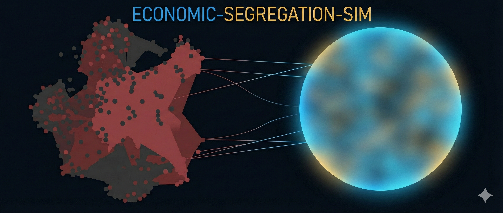

> [!WARNING]
> **Guía de Instalación:** Si buscas cómo instalar o ejecutar el proyecto, desplázate hasta la sección **🚀 Instalación y Configuración** que encontrarás más abajo.



# Dinámicas de Segregación Socioeconómica y Contagio Emocional en Redes Sociales

> [!TIP]
> **Web del Proyecto (Documentación Online)**
> Puedes consultar la documentación completa, resultados interactivos y metodología en nuestra página web:
> 👉 **[https://jxliian.github.io/ABM-Income-Interpersonal-Relations-Impact-on-Happiness](https://jxliian.github.io/ABM-Income-Interpersonal-Relations-Impact-on-Happiness)**

---

## 📂 Estructura del Proyecto

```text
.
├── codigo/                # Código fuente del modelo, entorno (.yml) y utilidades.
├── documentos_datos/      # Microdatos del CIS, datos procesados y documentación.
├── notebook/              # Versión interactiva (Jupyter Notebook) y requirements.txt.
├── web/                   # Archivos de la web de documentación (GitHub Pages).
├── dist/                  # Ejecutable generado para Windows y Linux.
└── build/                 # Archivos auxiliares de la compilación.
```

---

Este repositorio implementa un **Modelo Basado en Agentes (ABM)** en Python para simular la dinámica de la felicidad, la segregación económica y la sociabilidad en redes sociales. El proyecto utiliza microdatos reales del **Centro de Investigaciones Sociológicas (CIS)** para calibrar los agentes, trascendiendo los modelos puramente teóricos.

## 🚀 Instalación y Configuración

El proyecto admite varios métodos de ejecución. **Si no tienes experiencia técnica, utiliza la Opción 1 (VS Code).**

### 💻 1. Jupyter Notebook vía VS Code (Recomendado)

Es la forma más sencilla de ejecutar el cuaderno interactivo y gestionar las librerías automáticamente (es necesario tener instalado Python 3.10++):

1.  **Abrir Carpeta:** Abre la carpeta raíz del proyecto en Visual Studio Code. La del proyecto entera.
2.  **Abrir el Notebook:** Ve a la carpeta `notebook/` y abre `ABM_Simulacion.ipynb`.
3.  **Seleccionar Kernel:** Arriba a la derecha, pulsa en **"Select Kernel"**. Selecciona el kernel, y si no tienes creado previamente el entorno para nuestro trabajo, debes seleccionar: PASO 4 y 5.
4.  **Configurar Entorno:** Elige tu entorno de Python preferido (Venv). Si no tienes uno activo, pulsa en **"Create Python Environment"** y sigue las instrucciones de VS Code: Python Environments -> Create Environment -> Venv -> La versión de Python que desee a poder ser igual o superior a 3.10 -> Seleccionas requirements.txt que te instalará todas las librerías necesarias. -> OK. 
5.  **Instalación:** Asegúrate de instalar las librerías necesarias usando el archivo `notebook/requirements.txt` (VS Code suele ofrecer la instalación automática al detectar el archivo, es lo que has visto en el paso anterior).
6.  **Final:** A partir de aquí ya tendrías nuestro entorno con nuestras librerías y sería solo ejecutar el notebook.

> [!TIP]
> **Usuarios de Linux:** Ejecutar el notebook dentro de un entorno virtual (ya sea creado desde VS Code o de forma externa) garantiza que no haya conflictos con el sistema operativo.

### 🪟 2. Windows (Sin instalar nada)

Si solo quieres probar la aplicación rápidamente:

1.  **Descarga el repositorio:** Pulsa en el botón verde `<> Code` -> `Download ZIP`.
2.  **Descarga el ejecutable:** Ve a [Actions](https://github.com/jxliian/ABM-Income-Interpersonal-Relations-Impact-on-Happiness/actions) y baja el artefacto `ABM_Happiness_Tool_Windows`. (Actualmente este paso ya no es necesario, pues ya incluimos el ejecutable en la carpeta raíz del repositorio, pero si quieres tener la última versión del ejecutable, puedes descargarlo de aquí (actualmente el ejecutable ya es el último disponible))
3.  **Ubicación:** Mueve el `.exe` **DENTRO** de la carpeta raíz descargada. (Actualmente el ejecutable ya está en la carpeta raíz del repositorio)
4.  **Ejecuta:** Doble clic en `ABM_Happiness_Tool.exe`.

> [!WARNING]
> **Windows:** Si te da algún error lo más posible que se deba a la disposición de los archivos. Para ello, debes entrar en la carpeta de documentos_datos y sacar la carpeta data al nivel raíz del repositorio. (Solo para este modo, si quieres realizar la simulación desde los otros métodos, debes tener la carpeta data dentro de la carpeta documentos_datos)


### 🐧 3. Linux / Desarrolladores (Conda + Terminal)

Para un control total del entorno:

1.  **Crear Entorno:**
    ```bash
    conda env create -f codigo/environment.yml
    ```
2.  **Activar:** `conda activate abm_seminario`
3.  **Lanzar:** `python codigo/src/graphics.py`

---

## 🎮 Uso de la Simulación

Una vez lanzada la aplicación (vía `graphics.py` o el ejecutable):

1.  **Selecciona el Escenario:**
    *   **Facebook / Instagram / X:** Datos reales del CIS calibrados mediante el modelo.
    *   **Modo Experimental:** Incluye el *Slider* de Salario Mínimo (SMI) en tiempo real.
2.  **Interacción:** Si usas el Slider, recuerda pulsar **Reset** y luego **Start** para aplicar los cambios en la población.

---

## 📝 Descripción del Modelo

El modelo simula cómo factores macroeconómicos afectan el bienestar micro a nivel individual, basándose en tres pilares fundamentales:

### Dinámicas Principales
*   **Homofilia Económica:** Los agentes tienden a agruparse espacialmente con otros de estatus socioeconómico similar.
*   **Contagio Emocional:** El bienestar de un agente se ve influenciado por su vecindad de Moore (entorno social inmediato).
*   **Política Económica (SMI):** Simulación del Salario Mínimo y su impacto en la cohesión y felicidad agregada.

👉 **[Guía Detallada: Cómo Funciona](./web/github_pages/como_funciona.md)**

---

## 📘 Fundamentación Teórica

El comportamiento de los agentes se rige por funciones de utilidad sociológicas avanzadas:

### 1. Función de Utilidad Cobb-Douglas Adaptada
La felicidad ($H$) depende del **Capital Económico ($E$)** y el **Tiempo Disponible ($R$)**, modulada por el factor cultural $\alpha$ (Materialismo):
*   $\alpha \to 1$: Sociedad Hiper-Materialista (el ingreso domina la felicidad).
*   $\alpha \to 0$: Sociedad Post-Materialista (el tiempo de ocio domina la felicidad).

### 2. Teorema de Resonancia Social Inversa
La sociabilidad ($S$) es una propiedad emergente: los agentes con niveles bajos de felicidad pierden gradualmente su capacidad de interacción y movilidad social.

---

## 👥 Autores y Créditos

*   **Julián Carrión Tovar**
*   **Fernando José Gracia Choin**

**Supervisión:** Prof. José Luis Sáez Lozano (Universidad de Granada).

**Fuentes de Datos:** [CIS](https://www.cis.es), Estudio 3145 (Microdatos de Redes Sociales).

---
*Proyecto desarrollado para la asignatura de Economía Mundial del Doble Grado en Ingeniería Informática y ADE de la Universidad de Granada.*
