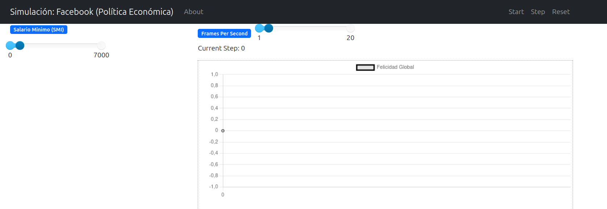
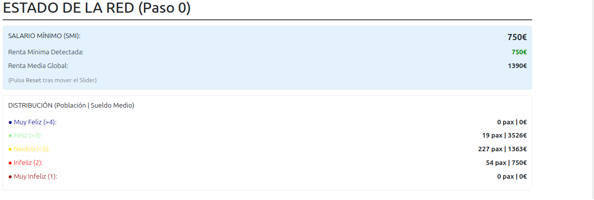
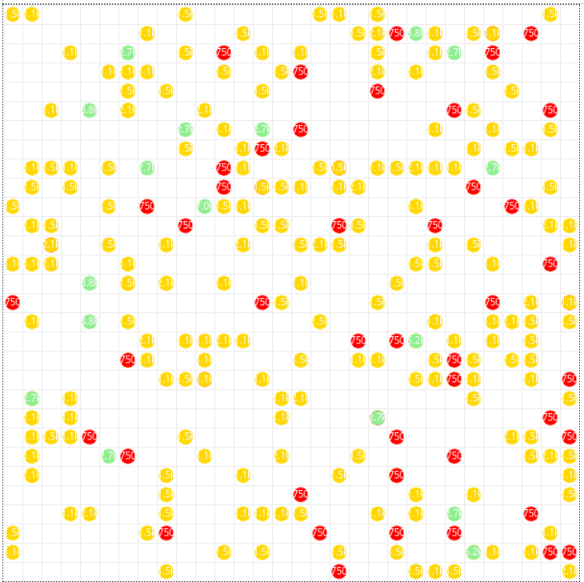

# Cómo Funciona la Herramienta
{: .fs-9 }

Esta página explica el flujo de trabajo interno de la aplicación, desglosando el proceso en cuatro etapas fundamentales.

> [!NOTE]
> **Información Importante:** Si has seguido la guía de instalación estándar o estás utilizando el archivo ejecutable, **los Pasos 1, 2 y 3 se realizan de forma automática e interna**. No es necesario que te preocupes por ellos. Esta sección sirve para que comprendas el proceso lógico que sigue el software.

---

## Paso 1: Filtrado de Datos
*(Automatizado)*

El sistema comienza procesando los datos brutos. Se realiza una limpieza exhaustiva de la base de datos para seleccionar únicamente los registros válidos y relevantes, descartando valores nulos o inconsistentes que podrían alterar la simulación.

## Paso 2: Modelo de Felicidad
*(Automatizado)*

A continuación, se entra en la fase de modelado. El algoritmo aplica la función de utilidad teórica (Cobb-Douglas) a cada agente individual. En este paso se calcula el nivel de bienestar inicial de cada individuo basándose en sus parámetros económicos y de tiempo disponible.

## Paso 3: Cálculo de Coeficientes
*(Automatizado)*

Antes de visualizar nada, el sistema realiza cálculos estadísticos internos. Se computan los coeficientes de correlación necesarios para establecer las relaciones dinámicas entre los agentes. Esto asegura que el comportamiento, como la homofilia o la segregación, se base en métricas consistentes.

---

## Paso 4: Ejecución Visual e Interacción
**Este es el paso principal donde tú tomas el control.**

Una vez que el sistema ha preparado el "mundo" (Pasos 1-3), se lanza el servidor de visualización en tu navegador. Aquí puedes ver la simulación en tiempo real y experimentar con ella.

### Instrucciones para el Modo Experimental (Slider)

Si estás utilizando el modo con parámetros ajustables (como el Slider de Salario Mínimo o *SMI*), sigue estos pasos para asegurar que tus cambios surtan efecto:

1.  **Ajusta el Slider:** Mueve el deslizador del SMI (o cualquier otro parámetro) al valor que desees probar.
2.  **Reinicia el Mundo:** Inmediatamente después de mover el slider, pulsa el botón **Reset** situado en la barra superior. Esto reconstruye el mundo con los nuevos parámetros.
3.  **Inicia la Simulación:** Pulsa el botón **Start** para ver cómo evoluciona la sociedad con tu nueva configuración.

> [!TIP]
> **Recuerda:** Si cambias un parámetro durante la ejecución (mientras corre) y no pulsas Reset, el cambio podría no aplicarse correctamente a la estructura inicial de los agentes. ¡El botón **Reset** es tu amigo!

---

## Guía Visual

A continuación detallamos el proceso con capturas de la herramienta:

### 1. Interfaz Principal

### 2. Uso de Parámetros

### 3. Visualización de Resultados

