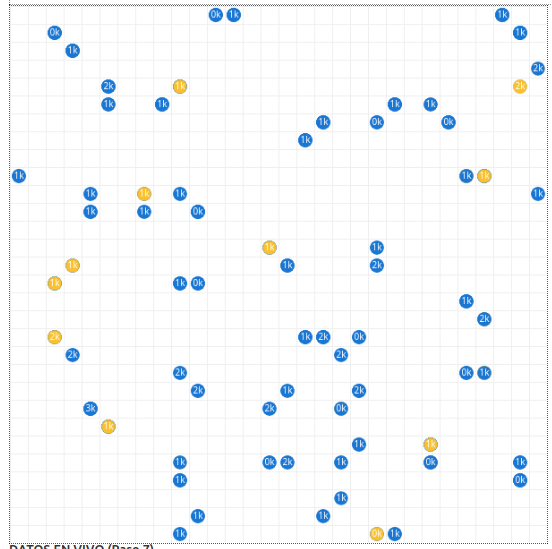
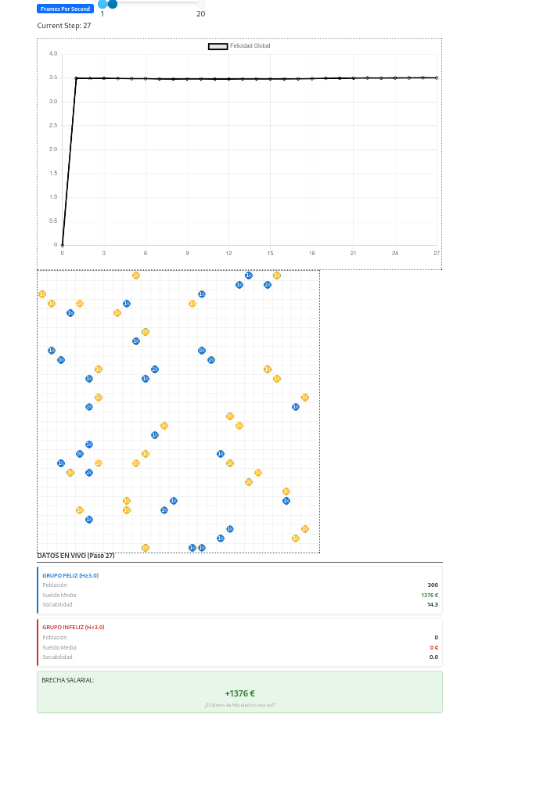
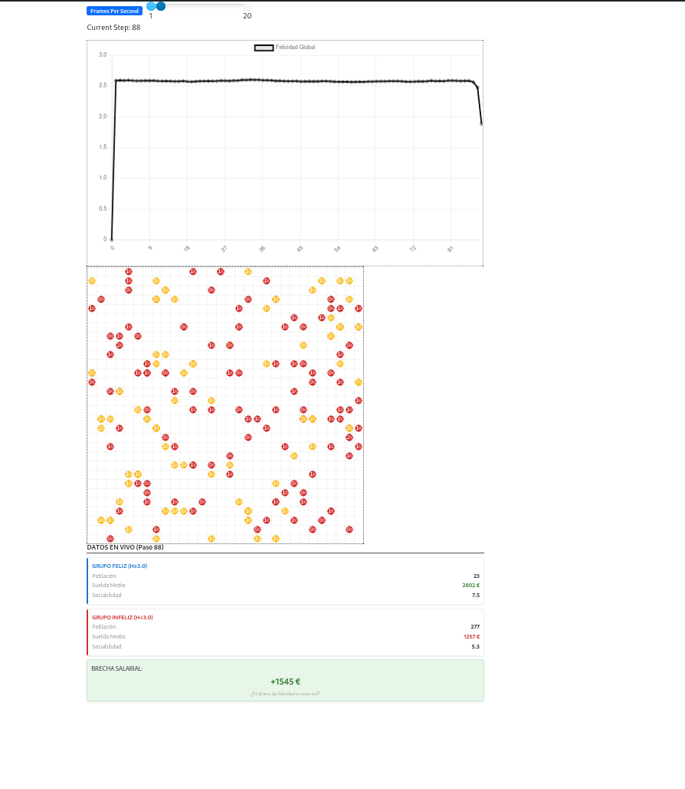
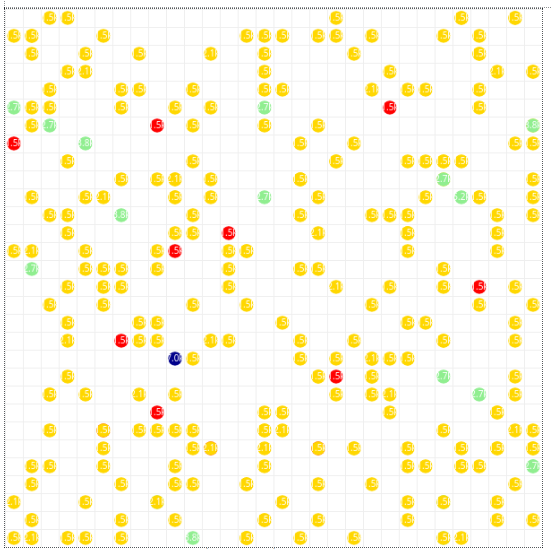
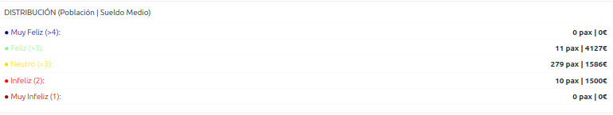
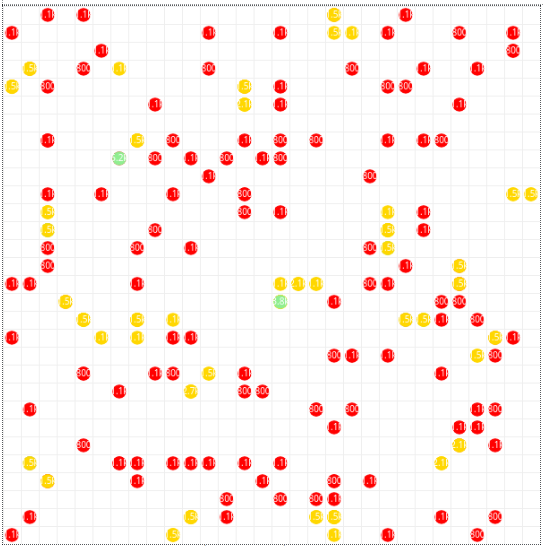
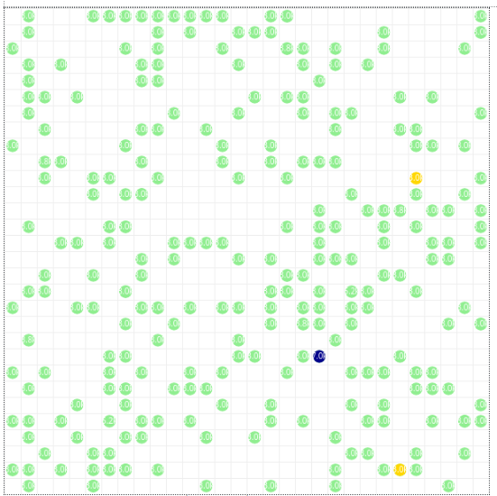
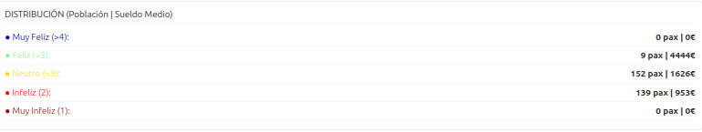
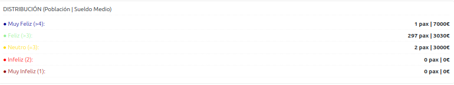

# Resultados y Análisis de Escenarios
{: .fs-9 }

## 1. Segregación Espacial (Cámaras de Eco)

La simulación muestra una rápida transición de una distribución aleatoria a una estructura altamente segregada. Como se observa en el mapa de agentes final, emergen **"barrios digitales"** homogéneos económicamente.

*Figura 1: Estado final de la simulación. Los puntos azules representan agentes felices y los amarillos/rojos agentes infelices.*

> **Fenómeno Observado:** Los agentes ricos crean "burbujas de bienestar" aislándose de la infelicidad sistémica de los agentes pobres. El dinero actúa como un escudo emocional.

### Análisis de la Brecha Salarial
El monitor en tiempo real revela una brecha salarial persistente y significativa entre los grupos felices e infelices.

| Grupo | Sueldo Medio | Población Aprox. |
| :--- | :--- | :--- |
| **Felices** ($H \ge 3.0$) | 2,691 € | ~ 8% |
| **Infelices** ($H < 3.0$) | 1,275 € | ~ 92% |

## 2. Ejecuciones y Análisis de Escenarios

Para evaluar la sensibilidad del modelo, se realizaron ejecuciones modificando el parámetro de elasticidad cultural $\alpha$ (materialismo).

### Escenario 1: Sociedad Post-Materialista ($\alpha \approx 0.2$)
Simulamos una cultura que valora más el tiempo disponible ($R$) que el capital ($E$).

*Figura 2: Evolución en entorno de Bajo Materialismo. Se observa una predominancia de agentes felices dispersos homogéneamente.*

*   **Resultado:** Desacople entre ingreso y bienestar.
*   **Interpretación:** Sociedad resiliente a la pobreza económica. La cohesión social se mantiene alta. _"Pobreza feliz"._

### Escenario 2: Sociedad Hiper-Materialista ($\alpha \approx 0.8$)
Configuramos una sociedad donde la felicidad depende casi exclusivamente del nivel de ingresos.

*Figura 3: Resultados del escenario hiper-materialista: polarización extrema y segregación espacial.*

*   **Resultado:** Polarización extrema. La felicidad se convierte en un bien exclusivo de las clases altas.
*   **Interpretación:** Ansiedad de estatus. Segregación máxima. Los ricos se aíslan rápidamente para proteger su bienestar.

### Escenario 3: Impacto de Políticas Redistributivas (SMI Variable)
Introducimos un **Salario Mínimo Interprofesional (SMI)** dinámico.

*Figura 4: Impacto de un SMI Moderado (Comparativa Anterior vs Actual).*

| SMI Bajo (750€) | SMI Alto (3000€) |
| :---: | :---: |
| **Anterior** | **Anterior** |
|  |  |
| **Actual** | **Actual** |
|  |  |

*   **Resultado:** El aumento del SMI actúa como un **"ascensor emocional"**.
*   **Interpretación:** Garantizar la suficiencia material reactiva la sociabilidad en la base de la pirámide.

## Síntesis General

El análisis conjunto permite concluir que el bienestar en redes sociales es multifactorial. La combinación más nociva es una cultura hiper-materialista ($\alpha \to 1$) combinada con baja protección salarial.
